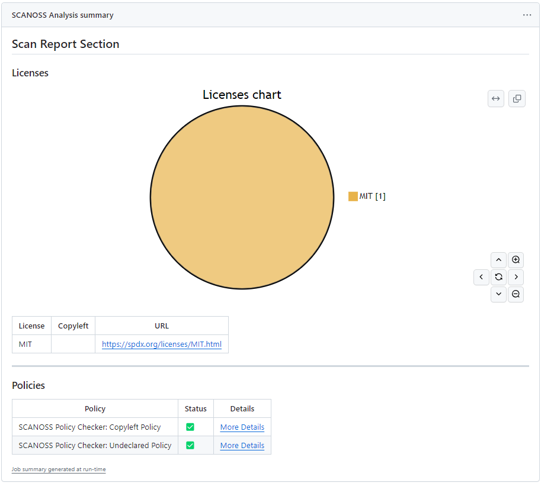
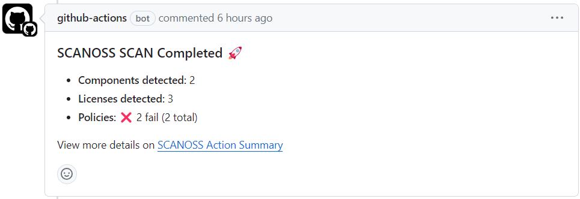

# SCANOSS Code Scan Action

[](https://github.com/super-linter/super-linter)

[](https://github.com/scanoss/scanoss-code-scan-step/actions/workflows/check-dist.yml)
[](https://github.com/scanoss/scanoss-code-scan-step/actions/workflows/codeql-analysis.yml)


The SCANOSS Code Scan Action enhances your software development process by automatically scanning your code for security
vulnerabilities and license compliance with configurable policies.

<div style="text-align: center">
  
  

</div>

## Usage

To begin using this action, you'll need to set up a basic GitHub workflow and define a job within it:

```yaml
name: Example Workflow with SCANOSS

on:
  pull_request:
  push:
    branches:
      - '*'

permissions:
  contents: read
  pull-requests: write
  checks: write
  actions: read

jobs:
  scanoss-code-scan:
    name: SCANOSS Code Scan 
    runs-on: ubuntu-latest

    steps:
      - name: Checkout code
        uses: actions/checkout@v4

      - name: Run SCANOSS Code Scan
        id: scanoss-code-scan-step
        uses: scanoss/code-scan-action@v0
```

For example workflow runs, check out our
[GitHub Action Usage Example](https://github.com/scanoss/integration-github-actions) :rocket:

### Action Input Parameters

| **Parameter**              | **Description**                                                                                      | **Required** | **Default**                         | 
|----------------------------|------------------------------------------------------------------------------------------------------|--------------|-------------------------------------|
| output.filepath            | Scan output file name.                                                                               | Optional     | `results.json`                      |
| sbom.enabled               | Enable or disable scanning based on the SBOM file                                                    | Optional     | `true`                              |
| sbom.filepath              | Filepath of the SBOM file to be used for scanning                                                    | Optional     | `sbom.json`                         |
| sbom.type                  | Type of SBOM operation: either 'identify' or 'ignore                                                 | Optional     | `identify`                          |
| dependencies.enabled       | Option to enable or disable scanning of dependencies.                                                | Optional     | `false`                             |
| dependencies.scope         | Gets development or production dependencies (scopes - prod|dev)                                              | Optional     | -                                   |
| dependencies.scope.include | Custom list of dependency scopes to be included. Provide scopes as a comma-separated list.                                              | Optional     | -                                   |
| dependencies.scope.exclude | Custom list of dependency scopes to be excluded. Provide scopes as a comma-separated list.                     | Optional     | -                                   |
| policies                   | List of policies separated by commas, options available are: copyleft, undeclared.                   | Optional     | -                                   |
| policies.halt_on_failure   | Halt check on policy failure. If set to false checks will not fail.                                  | Optional     | `true`                              |
| api.url                    | SCANOSS API URL                                                                                      | Optional     | `https://osskb.org/api/scan/direct` |
| api.key                    | SCANOSS API Key                                                                                      | Optional     | -                                   |
| licenses.copyleft.include  | List of Copyleft licenses to append to the default list. Provide licenses as a comma-separated list. | Optional     | -                                   |
| licenses.copyleft.exclude  | List of Copyleft licenses to remove from default list. Provide licenses as a comma-separated list.   | Optional     | -                                   |
| licenses.copyleft.explicit | Explicit list of Copyleft licenses to consider. Provide licenses as a comma-separated list.          | Optional     | -                                   |

### Action Output Parameters

In addition to the automatically generated reports, the action also outputs the raw scan data, enabling you to integrate
the output into your custom workflow

| **Parameter**       | **Description**          |
|---------------------|--------------------------|
| result-filepath     | Scanner results filepath |  
| stdout-scan-command | Scanner command output   |

## Policy Checks
The SCANOSS Code Scan Action includes two configurable policies:

1. Copyleft: This policy checks if any component or code snippet is associated with a copyleft license. If such a
   license is detected, the pull request (PR) is rejected. The default list of Copyleft licenses is defined in the following [file](https://github.com/scanoss/gha-code-scan/blob/main/src/utils/license.utils.ts).

2. Undeclared: This policy compares the components detected in the repository against those declared in an sbom.json
   file (customizable through the sbom.filepath parameter). If there are undeclared components, the PR is rejected.

In this scenario, a classic policy is executed that will fail if copyleft licenses are found within the results:


Additionally, if it is a Pull Request, a comment with a summary of the report will be automatically generated.



## Full example

```yaml
name: Full Example Workflow with SCANOSS

on:
  pull_request:
  push:
    branches:
      - '*'

permissions:
  contents: read
  pull-requests: write
  checks: write
  actions: read

jobs:
   scanoss-code-scan:
    name: SCANOSS Code Scan
    runs-on: ubuntu-latest

    steps:
      - name: Checkout code
        uses: actions/checkout@v4

      - name: Run SCANOSS Code Scan
        id: scanoss-code-scan-step
        uses: scanoss/code-scan-action@v0
        with:
          policies: copyleft, undeclared  #NOTE: undeclared policy requires a sbom.json in the project root
          dependencies.enabled: true
          # api-url: <YOUR_API_URL>
          # api-key: <YOUR_API_KEY>


      - name: Print stdout scan command
        run: echo "${{ steps.scanoss-code-scan-step.outputs.stdout-scan-command }}"

      - name: Print Results
        run: cat "${{ steps.scanoss-code-scan-step.outputs.result-filepath }}"
```