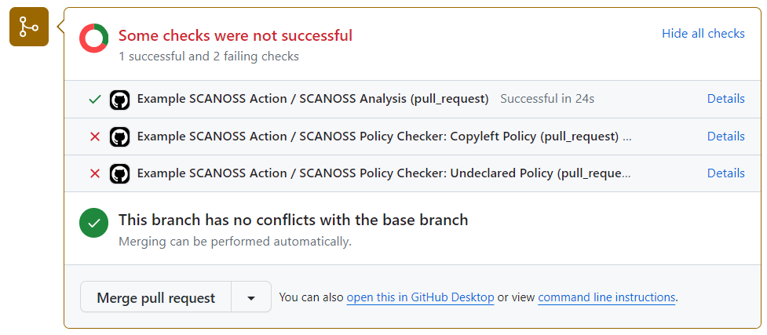

# SCANOSS Action

[](https://github.com/super-linter/super-linter)

[](https://github.com/scanoss/actions-scan/actions/workflows/check-dist.yml)
[](https://github.com/scanoss/actions-scan/actions/workflows/codeql-analysis.yml)


The SCANOSS Scan Action enhances your software development workflow by automatically scanning for security vulnerabilities and license compliance issues.


## Usage
To begin using this action, you'll need to set up a basic GitHub workflow and define a JOB within it:


```yaml
name: Example Workflow with SCANOSS

on:
  pull_request:
  push:
    branches:
      - '*'

permissions:
  contents: read
  pull-requests: write
  checks: write

jobs:
  scanoss-analysis:
    name: SCANOSS Analysis
    runs-on: ubuntu-latest

    steps:
    - name: Checkout code
      id: checkout
      uses: actions/checkout@v4

    - name: Run SCANOSS analysis
      id: scanoss-scan-action
      uses: scanoss/actions-scan@main
```

For example workflow runs, check out the
[Actions Tab](https://github.com/scanoss/actions-scan/actions)! :rocket:

### Action Input Parameters

| **Parameter**        | **Description**                                                       | **Required** | **Default**                         | 
|----------------------|-----------------------------------------------------------------------|--------------|-------------------------------------|
| github.token         | Your GitHub token                                                     | Optional     | `${{ github.token }}`               | 
| output.filepath      | Output result file name.                                              | Optional     | `results.json`                      |
| sbom.enabled         | Enable or disable scanning based on the SBOM file                     | Optional     | `true`                              |
| sbom.filepath        | Filepath of the SBOM file to be used for scanning                     | Optional     | `sbom.json`                         |
| sbom.type            | Type of SBOM operation: either 'identify' or 'ignore                  | Optional     | `identify`                          |
| dependencies.enabled | Option to enable or disable scanning of dependencies.                 | Optional     | `true`                              |
| policies             | List of policies separated by commas, such as "copyleft, undeclared". | Optional     | `true`                              |
| api.url              | SCANOSS API URL                                                       | Optional     | `https://osskb.org/api/scan/direct` |
| api.key              | SCANOSS API Key token                                                 | Optional     | -                                   |

### Action Output Parameters
In addition to the automatically generated reports, the action also outputs the raw scan data, enabling you to integrate the output into your custom workflow

| **Parameter** | **Description**                                |
|---------------|------------------------------------------------|
| result-filepath | Scanner results filepath |  
| stdout-scan-command  | Scanner command output |


## Policy Checks (wip)
Once the workflow is set up, the SCANOSS Scan action will execute checks using some "out of the box" policies. The workflow will fail if any of the policies are not met.

In this scenario, a classic policy is executed that will fail if copyleft licenses are found within the results:




Additionally, if it is a Pull Request, a comment with a summary of the report will be automatically generated.


## Full example

```yaml
name: Full Example Workflow with SCANOSS

on:
  pull_request:
  push:
    branches:
      - '*'

permissions:
  contents: read
  pull-requests: write
  checks: write

jobs:
  scanoss-analysis:
    name: SCANOSS Analysis
    runs-on: ubuntu-latest

    steps:
    - name: Checkout code
      id: checkout
      uses: actions/checkout@v4

    - name: Run SCANOSS analysis
      id: scanoss-scan-action
      uses: scanoss/actions-scan@main
      with:
        github.token: ${{ secrets.GITHUB_TOKEN }}
        # api-url: <YOUR_API_URL>
        # api-key: <YOUR_API_KEY>
        dependencies.enabled: true

      - name: Print stdout scan command
        run: echo "${{ steps.scanoss-scan-action.outputs.stdout-scan-command }}"

      - name: Print Results
        run: cat "${{ steps.scanoss-scan-action.outputs.result-filepath }}"
```